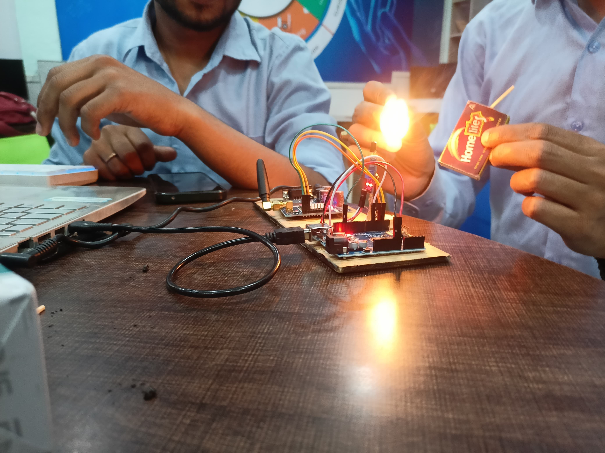
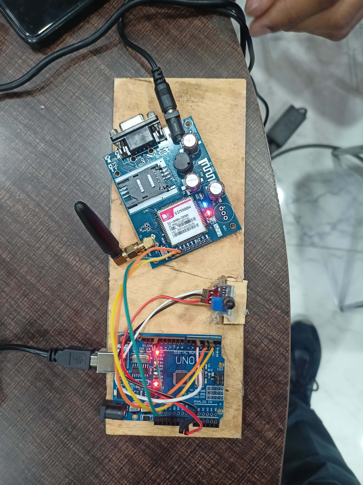

# Ignis Guard – Smart Fire Detection and Alert System

**Ignis Guard** is a smart fire detection project built using Arduino Uno and SIM900 GSM Module. It detects fire using a flame sensor and immediately sends **SMS alerts**, **Location** and **makes calls** to pre-saved mobile numbers. The system also activates an LED and buzzer alarm for immediate surroundings.

---

##  Hardware Components Used

| Component        | Description                         |
|------------------|-------------------------------------|
| Arduino Uno      | Microcontroller board               |
| SIM900 GSM Module| For sending SMS & making calls      |
| Flame Sensor     | Detects fire/flame                  |
| Buzzer           | Gives sound alert                   |
| LED              | Visual alert                        |
| Jumper Wires     | For circuit connections             |
| Breadboard       | For prototyping                     |

---

## Features

- Real-time **Fire Detection**
- **SMS alert** to up to 3 mobile numbers
- **Auto-call** on fire detection
- Buzzer + LED activation for local warning
- GPS Real-time **Location**
- Low-cost & Easy to deploy

---

## Circuit Diagram

>  **[Upload your circuit image here and update the link]**



---

##  Real Images of the Project

> Add photos in the `images/` folder.



---

## Folder Structure

```plaintext
Ignis_Guard/
├── ignis_guard.ino
├── README.md
└── images/
    ├── circuit_diagram.jpg
    └── project_real_photo.jpg
